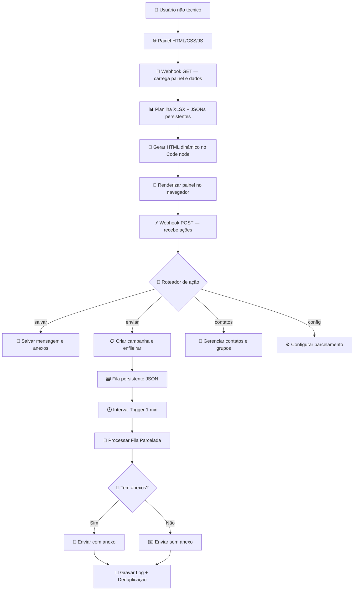

<p align="center">
  
</p>

<h1 align="center">Mala Direta</h1>
<p align="center">
  <strong>Automação para envio de e-mails em lote com n8n, painel web, filas persistentes e deduplicação.</strong>
</p>

<p align="center">
  <a href="README.en.md">🇺🇸 Read in English</a>
  &nbsp;|&nbsp;
  <a href="https://github.com/projetosvesper-star/Mala-direta-N8N">GitHub</a>
  &nbsp;|&nbsp;
  <a href="docs/ARCHITECTURE.md">Arquitetura</a>
  &nbsp;|&nbsp;
  <a href="docs/TECHNICAL_DECISIONS.md">Decisões Técnicas</a>
</p>

<p align="center">
  
  
  
  
</p>

---

## O que é este projeto?

**Mala Direta** é um gerenciador de campanhas de e-mail em lote construído sobre o n8n. Substitui um processo manual e repetitivo por um painel web intuitivo, acessível a qualquer funcionário — sem precisar entrar no n8n, editar JSON ou rodar scripts.

### Problema de negócio

Antes deste projeto, o envio de comunicados corporativos dependia de:

- Copiar e colar e-mails um a um no cliente de e-mail
- Risco de expor destinatários ao usar CC em vez de BCC
- Controle de contatos em planilha sem validação de duplicatas
- Dificuldade com anexos (arquivos, prints, imagens)
- Ausência de histórico ou rastreabilidade de envios
- Necessidade de acessar interfaces técnicas para qualquer envio
- Reenvios acidentais para quem já havia recebido

### Solução desenvolvida

Um **painel web** que roda dentro do n8n (webhook GET) com todas as funcionalidades num único lugar — sem frameworks, sem servidores adicionais, sem instalação nos computadores dos usuários.

---

## Funcionalidades principais

| Área | Funcionalidades |
|---|---|
| **Mensagem** | Assunto, texto, prévia em tempo real, assinatura automática |
| **Anexos** | Ctrl+V para colar prints, arrastar e soltar, escolher arquivos, remoção |
| **Teste** | Envio para e-mail interno antes do disparo real |
| **Destinatários** | Busca, filtro por grupo, marcação em lote, envio individual |
| **Contatos** | Adicionar manual, importar CSV/TXT/VCF, colar linhas do Excel |
| **Grupos inteligentes** | Criar, renomear, excluir, membros aparecem marcados automaticamente |
| **Parcelamento** | Lote configurável, intervalo em minutos ou horas |
| **Deduplicação** | Anti-reenvio por campanha + proteção global por impressão digital |
| **Histórico** | Logs com data, empresa, status e erro no próprio painel |
| **Segurança** | Dados fora do container, credenciais via `.env` |

---

## Arquitetura



➡️ [Ver arquitetura completa](docs/ARCHITECTURE.md)

---

## Screenshots

| Dashboard | Mensagem e prévia |
|---|---|
|  |  |

| Seleção de destinatários | Grupos inteligentes |
|---|---|
|  |  |

| Configuração parcelada | Workflow n8n |
|---|---|
|  |  |

---

## Como executar

### Pré-requisitos

- [Docker Desktop](https://www.docker.com/products/docker-desktop/)
- Pasta de dados em `C:\n8n\files` (ou equivalente mapeada no volume Docker)

### 1. Subir o n8n

Use o `docker-compose.yml` em `C:\n8n` (porta **5678**):

```powershell
cd C:\n8n
docker compose up -d
```

### 2. Importar o workflow

```powershell
docker cp workflow/mala-direta.json n8n-vesper:/tmp/mala-direta.json
docker exec n8n-vesper n8n import:workflow --input=/tmp/mala-direta.json
docker exec n8n-vesper n8n publish:workflow --id=<ID_DO_WORKFLOW>
docker restart n8n-vesper
```

Configure credenciais SMTP no n8n após a importação.

### 3. Acessar o painel

```
http://localhost:5678/webhook/mala-direta
```

Na rede interna, use o IP do servidor onde o Docker está rodando:

```
http://<IP-do-servidor>:5678/webhook/mala-direta
```

### Scripts úteis

```powershell
npm install
npm run validate        # valida o JSON do workflow
npm run security-scan   # varredura de segredos no repositório
npm run screenshots     # gera capturas (requer login no n8n)
```

---

## Segurança

- Credenciais SMTP e login do n8n ficam **fora** do repositório (`.env`, credenciais do n8n)
- O JSON versionado não inclui credenciais n8n embutidas
- Deduplicação em dois níveis (campanha e global)
- Validação de tamanho de anexos no cliente

➡️ [Política de segurança](SECURITY.md) · [Privacidade](docs/PRIVACY_AND_SECURITY.md)

---

## Documentação

| Documento | Descrição |
|---|---|
| [ARCHITECTURE.md](docs/ARCHITECTURE.md) | Fluxo completo do sistema |
| [TECHNICAL_DECISIONS.md](docs/TECHNICAL_DECISIONS.md) | Decisões técnicas |
| [USER_FLOW.md](docs/USER_FLOW.md) | Jornada do usuário |
| [TESTING.md](docs/TESTING.md) | Checklist de testes |
| [TROUBLESHOOTING.md](docs/TROUBLESHOOTING.md) | Problemas comuns |
| [WORKFLOW_NOTES.md](workflow/WORKFLOW_NOTES.md) | Detalhes do workflow n8n |

---

<p align="center">
  Desenvolvido por <a href="https://github.com/Mayconxzdev">Mayconxzdev</a>
</p>
